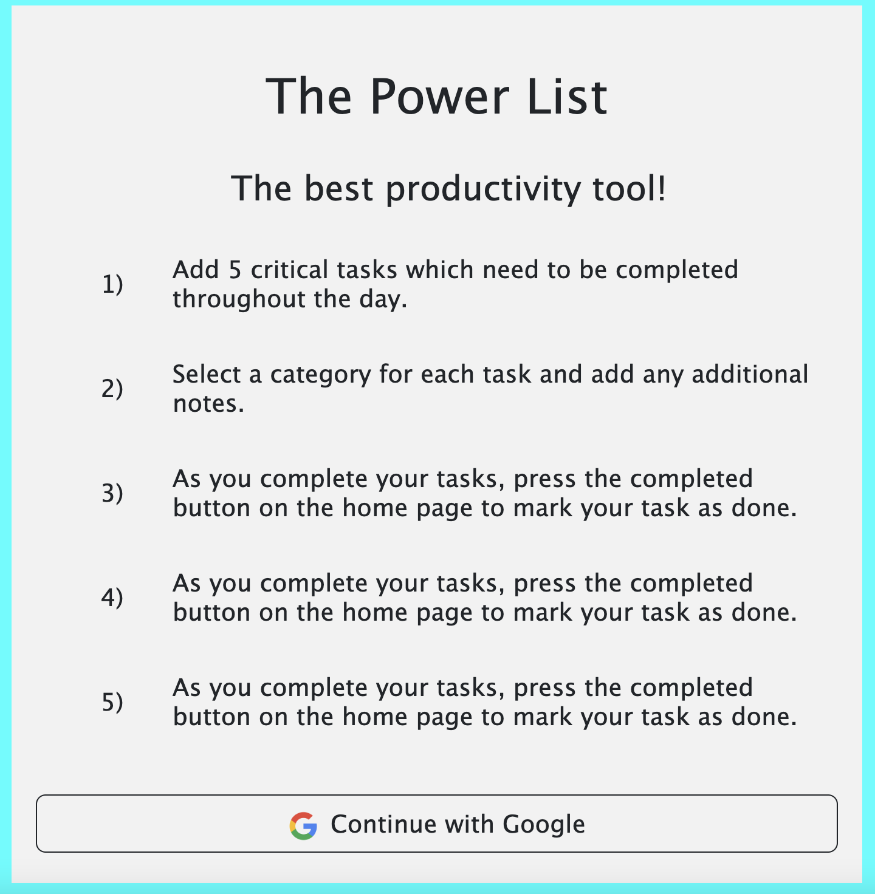
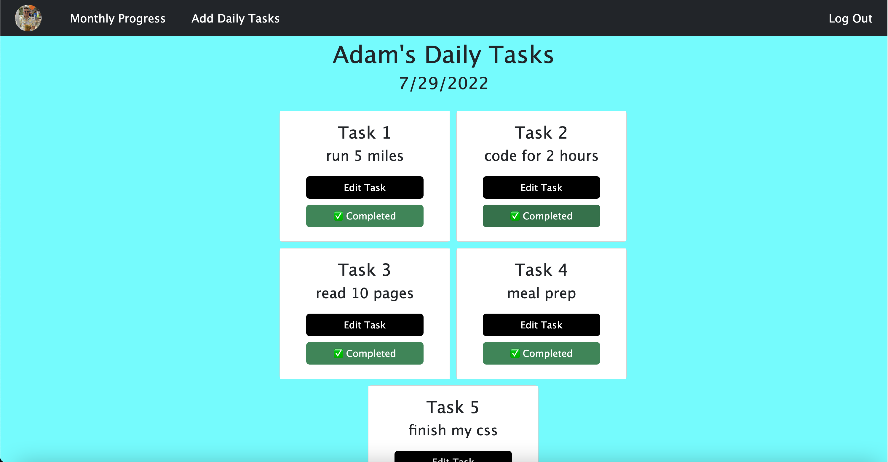
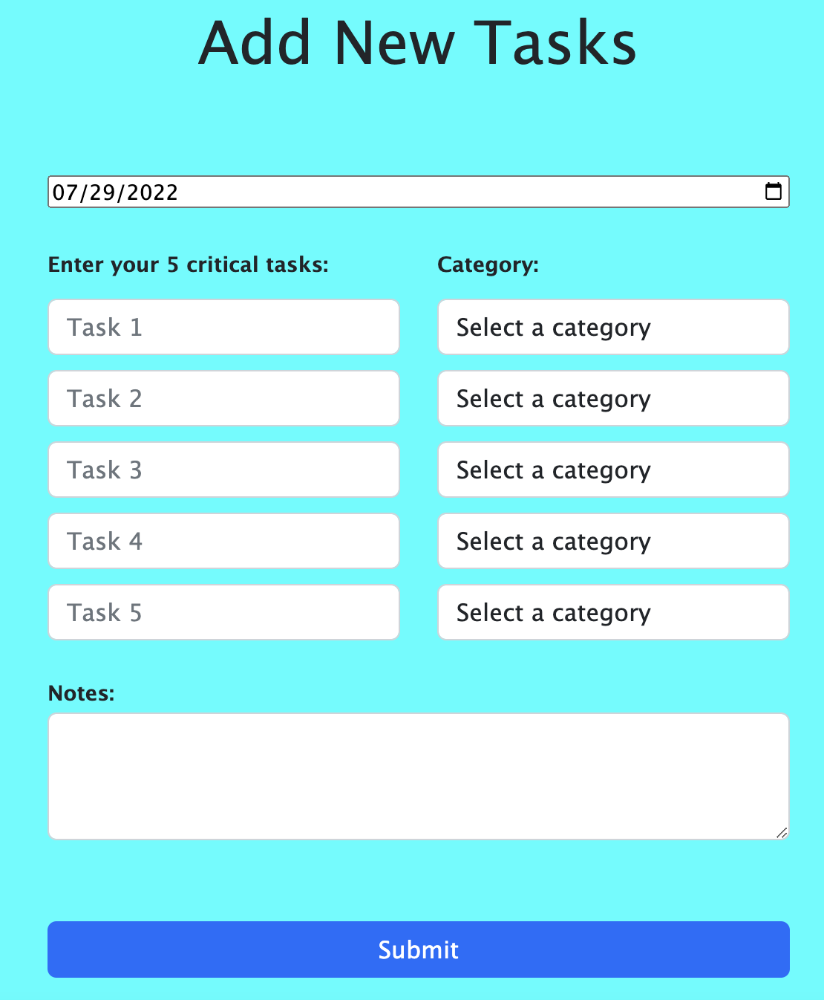
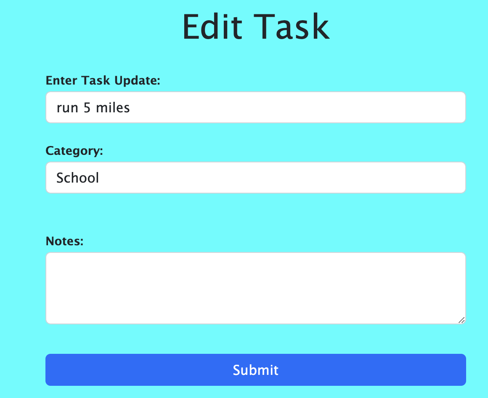

# The Power List
The Power List is a productivity tool for managing important tasks throughout your day. It is a simple, easy-to-use, and powerful tool for managing your day.  
  
Start by adding five important tasks that you need to complete throughout your day. Feel free to choose any type of task you can think of.  
  
Once you have added your tasks, you can start tracking your progress. Tasks will show on the home page as a grid of cards. As each task is accomplished, select the completion status button on the bottom of the task's card to mark it as complete. The calendar page will then render which days you have completed all 5 tasks. 

# Screenshots
### Instructions 

### Homepage

### Add Task

### Edit Task

# Technologies Used
- HTML
- CSS
- JavaScript
- Bootstrap
- Node.js
- Express.js

# Getting Started
[Click to use the Power List](https://the-power-list.herokuapp.com/)

# Next Steps
- Update styling to fit task cards on mobile
- Add index functionality to the calendar page to allow the user to see which days they've completed all tasks
- Add a counter to track how many days the user has completed all tasks
- Update CSS styles 